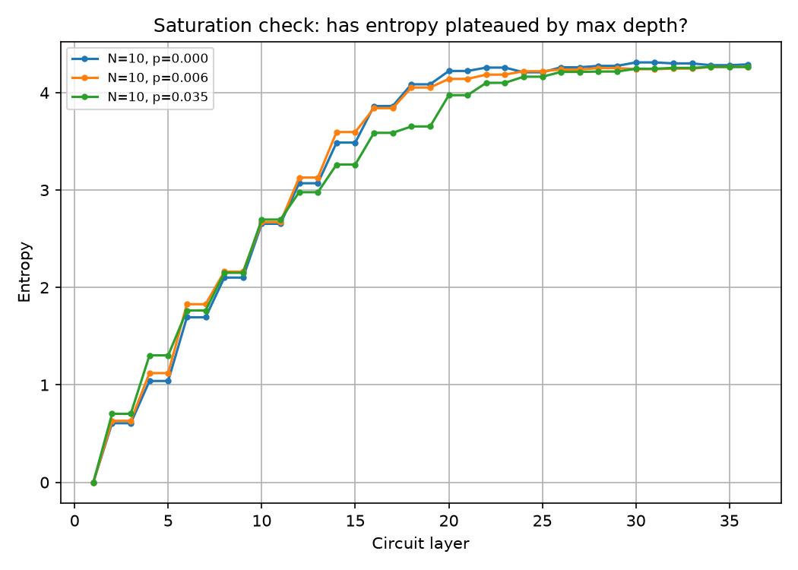
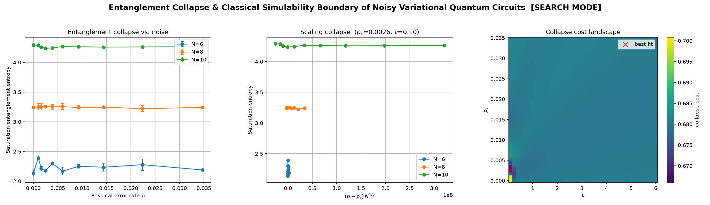
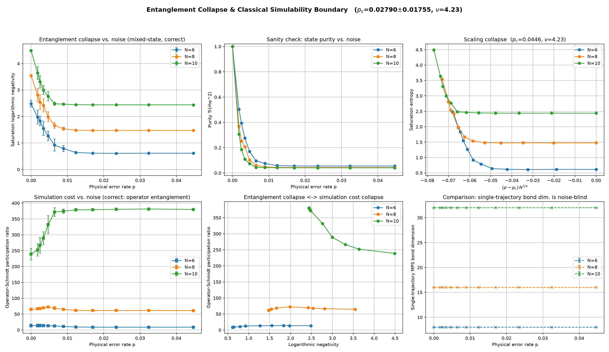

# Entanglement Collapse & Classical Simulability of Noisy Variational Quantum Circuits

> **Can realistic quantum noise destroy the quantum advantage of variational quantum circuits?**
>
> This repository investigates how quantum entanglement disappears under realistic noise and how that collapse is related to the classical simulability of variational quantum circuits using tensor-network methods.

---

# Abstract

Variational Quantum Algorithms (VQAs) are among the leading candidates for achieving useful near-term quantum computation. Their computational advantage, however, depends on maintaining quantum entanglement despite unavoidable hardware noise.

This project investigates how stochastic depolarizing noise affects the entanglement structure of hardware-efficient variational quantum circuits simulated with Matrix Product States (MPS).

Rather than assuming a particular complexity measure is appropriate, this work systematically evaluates several commonly used observables and identifies which ones correctly capture mixed-state entanglement and classical simulation complexity.

The project progresses through two experimental stages:

- **Experiment 1:** Demonstrates that conventional trajectory-based observables fail to detect entanglement collapse.
- **Experiment 2:** Introduces mixed-state reconstruction together with logarithmic negativity and operator-Schmidt analysis, revealing a clear relationship between entanglement degradation and classical simulation cost.

The central contribution is methodological:

> **Not every entanglement metric is appropriate for noisy quantum trajectory simulations. Choosing the wrong observable can completely hide the underlying physics.**

---

# Motivation

Many studies investigate

- Measurement-induced phase transitions
- Entanglement transitions
- Tensor-network simulation
- Quantum advantage

A more practical question remains:

> **At what point does realistic hardware noise make a variational quantum circuit easy to simulate classically?**

Answering this question requires understanding both

- how quantum entanglement disappears,
- and how tensor-network simulation complexity changes with noise.

---

# Research Roadmap

This project was carried out in two sequential experimental stages.

---

## Experiment 1 — Can Pure-State Entropy Detect Entanglement Collapse?

The initial hypothesis followed the standard intuition from noisy quantum circuits:

> Increasing physical noise should reduce entanglement entropy and eventually reveal an entanglement transition.

To test this hypothesis:

- Hardware-efficient brickwork circuits were simulated with stochastic Pauli noise.
- Saturation entanglement entropy was measured.
- Finite-size scaling analysis was performed.

Unexpectedly,

- entropy remained nearly constant,
- scaling collapse failed,
- no meaningful critical point appeared.

Rather than treating this as a failed simulation, the result became the starting point for understanding **why** the chosen observable failed.

---

## Experiment 2 — Mixed-State Reconstruction

The negative result from Experiment 1 motivated a different approach.

Instead of analyzing individual noisy trajectories,

the project reconstructs the mixed-state density matrix


from many stochastic trajectories.

The analysis then measures

- Logarithmic Negativity
- Purity
- Operator-Schmidt Participation Ratio

These quantities successfully reveal

- entanglement collapse,
- mixed-state decoherence,
- and decreasing classical simulation complexity.

---

# Experimental Workflow

```
Hardware-efficient Variational Circuit
            │
            ▼
 Stochastic Pauli Noise
            │
            ▼
 Multiple Quantum Trajectories
            │
            ▼
 Density Matrix Reconstruction
            │
            ▼
 
  Logarithmic Negativity         
  Purity                         
  Operator-Schmidt Spectrum      
 
            │
            ▼
 Finite-Size Scaling Analysis
            │
            ▼
 Classical Simulability Analysis
```

---

# Figures

---

# Figure 1 — Entanglement Saturation Check





### Purpose

Before searching for an entanglement transition, it is necessary to verify that the chosen circuit depth is sufficient to generate maximal entanglement.

Otherwise, an apparent absence of a transition could simply be caused by an under-evolved circuit.

### Observation

- Entanglement increases rapidly with circuit depth.
- Around 30–35 layers the entropy saturates.
- Additional layers produce almost no further increase.
- Different physical noise rates produce nearly identical saturation curves.

### Conclusion

The circuits are sufficiently deep.

Therefore, the later failure of entropy is **not** caused by insufficient circuit depth.

---

# Figure 2 — Experiment 1: Pure-State Entropy Search (Negative Result)

**Image Placeholder**





This figure summarizes the original entropy-based search.

---

### Panel A — Saturation Entropy vs Noise

Shows saturation bipartite entanglement entropy for several system sizes.

Observation:

- Entropy remains nearly constant.
- Increasing physical noise produces almost no change.

---

### Panel B — Finite-Size Scaling Collapse

Attempts to collapse the entropy curves using conventional finite-size scaling.

Observation:

- Curves do not collapse onto a universal function.
- The fitted exponent moves toward the edge of the search range.

---

### Panel C — Collapse Cost Landscape

Shows the optimization landscape over

- critical noise $p_c$
- critical exponent $\nu$

Observation:

No clear global minimum exists.

---

## Scientific Interpretation

This experiment constitutes an important **negative result**.

It demonstrates that pure-state von Neumann entropy cannot detect entanglement collapse under stochastic Pauli trajectory simulations.

---

# Why Experiment 1 Failed

The explanation is mathematical rather than numerical.

Each sampled Pauli error is a **local unitary operation**.

Local unitaries preserve the Schmidt spectrum of an individual pure state.

Therefore

- Pure-state entropy remains unchanged.
- Schmidt rank remains unchanged.
- Single-trajectory MPS bond dimension remains unchanged.

The failure is therefore caused by the observable itself—not by the simulation.

---

# Figure 3 — Experiment 2: Mixed-State Entanglement Collapse

**Image Placeholder**





Motivated by Experiment 1, the analysis was reformulated using reconstructed mixed states.

---

### Panel A — Logarithmic Negativity

Measures genuine mixed-state quantum entanglement.

Observation:

- Negativity decreases smoothly with increasing noise.
- Larger systems begin with stronger entanglement.

---

### Panel B — Purity

Measures

$$
\mathrm{Tr}(\rho^2)
$$

Observation:

Purity decreases monotonically.

The reconstructed density matrix behaves physically.

---

### Panel C — Finite-Size Scaling

Repeating the scaling analysis with logarithmic negativity produces a meaningful interior optimum.

---

### Panel D — Operator-Schmidt Participation Ratio

The operator-Schmidt participation ratio changes systematically with increasing noise.
As logarithmic negativity decreases, the operator-level complexity increases and then approaches a plateau.
This shows that mixed-state entanglement and tensor-network operator complexity are not simply proportional.

### Panel E — Entanglement vs Classical Simulation Cost

Compares

- Logarithmic Negativity
- Operator-Schmidt Participation Ratio

Observation:

Both quantities decrease together.

This establishes a direct relationship between entanglement collapse and classical simulation complexity.

---

### Panel F — Single-Trajectory Bond Dimension

Observation:

Bond dimension remains almost constant despite increasing physical noise.

This independently confirms the conclusion from Experiment 1.

---


# Main Findings

- Pure-state entropy is insensitive to stochastic Pauli trajectory noise.
- Schmidt rank and single-trajectory bond dimension fail for the same mathematical reason.
- Mixed-state logarithmic negativity correctly captures entanglement collapse.
- The operator-Schmidt participation ratio changes systematically with noise and increases as logarithmic negativity decreases, indicating a        nontrivial relationship between mixed-state entanglement and operator-level simulation complexity .
- Entanglement collapse does not automatically imply reduced tensor-network simulation complexity; the mixed-state operator structure can become    more complex even as physical entanglement decreases  .
- Selecting the wrong observable can completely hide the physics of noisy quantum circuits.


# Current Limitations

- High-quality density-matrix reconstruction requires many trajectories.
- Results have been thoroughly validated for small systems; larger systems require additional computational resources.
- The operator-Schmidt participation ratio is used as a physically motivated proxy for simulation complexity. A full Matrix Product Operator (MPO) simulation remains future work.


# Future Work

- Larger system sizes
- Alternative variational ansätze
- Dephasing and amplitude-damping noise
- Matrix Product Operator (MPO) simulations
- Adaptive tensor-network compression
- Hardware validation
- Finite-size scaling with larger system sizes


